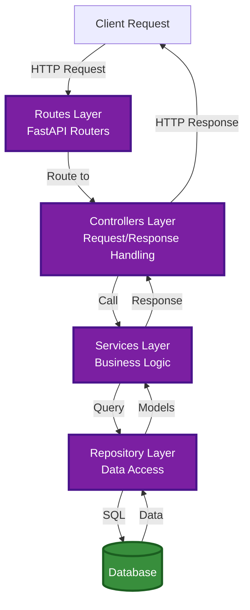
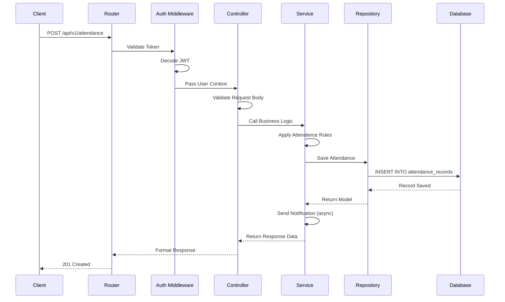

# API Architecture

This document describes the structure of the TAPWORK REST API, including endpoints, request/response formats, and architectural patterns.

---

## API Overview

The TAPWORK API is built with **FastAPI**, providing a modern, fast, and highly performant REST API with automatic OpenAPI documentation.

### Key Features
- **RESTful Design**: Resource-based URLs with standard HTTP methods
- **Automatic Documentation**: Swagger UI and ReDoc available at `/docs` and `/redoc`
- **Type Safety**: Pydantic models for request/response validation
- **Authentication**: JWT-based token authentication
- **Authorization**: Role-based access control (RBAC)
- **Validation**: Automatic request validation and error handling

---

## API Layers

The API follows a layered architecture pattern for separation of concerns:



### 1. Routes Layer
- Defines API endpoints and URL patterns
- Maps HTTP methods to controller functions
- Groups related endpoints into routers
- Applies middleware and dependencies

### 2. Controllers Layer
- Handles HTTP request/response logic
- Validates request data using Pydantic models
- Extracts authentication tokens
- Formats responses
- Handles exceptions

### 3. Services Layer
- Contains business logic
- Orchestrates multiple repository calls
- Implements validation rules
- Handles complex workflows
- Manages transactions

### 4. Repository Layer
- Direct database interaction
- CRUD operations
- Query construction
- Database transactions
- ORM model mapping

---

## API Endpoints

### Authentication Endpoints

#### Register User
```http
POST /api/v1/auth/register
Content-Type: application/json

{
  "email": "employee@company.com",
  "password": "SecurePass123!",
  "first_name": "John",
  "last_name": "Doe",
  "employee_id": "EMP001",
  "department_id": "uuid",
  "shift_id": "uuid"
}

Response: 201 Created
{
  "id": "uuid",
  "email": "employee@company.com",
  "employee_id": "EMP001",
  "qr_code": "base64_encoded_qr_image",
  "message": "Registration successful. QR code sent to email."
}
```

#### Login
```http
POST /api/v1/auth/login
Content-Type: application/json

{
  "email": "employee@company.com",
  "password": "SecurePass123!"
}

Response: 200 OK
{
  "access_token": "eyJhbGciOiJIUzI1NiIsInR5cCI6IkpXVCJ9...",
  "token_type": "bearer",
  "expires_in": 3600,
  "user": {
    "id": "uuid",
    "email": "employee@company.com",
    "role": "employee"
  }
}
```

#### Refresh Token
```http
POST /api/v1/auth/refresh
Authorization: Bearer {refresh_token}

Response: 200 OK
{
  "access_token": "new_jwt_token",
  "token_type": "bearer",
  "expires_in": 3600
}
```

---

### User Management Endpoints

#### Get Current User
```http
GET /api/v1/users/me
Authorization: Bearer {token}

Response: 200 OK
{
  "id": "uuid",
  "email": "employee@company.com",
  "first_name": "John",
  "last_name": "Doe",
  "employee_id": "EMP001",
  "department": "Engineering",
  "shift": "Morning Shift",
  "role": "employee",
  "is_active": true
}
```

#### List Users (Admin Only)
```http
GET /api/v1/users?page=1&limit=20&department_id=uuid&is_active=true
Authorization: Bearer {admin_token}

Response: 200 OK
{
  "total": 150,
  "page": 1,
  "limit": 20,
  "users": [
    {
      "id": "uuid",
      "email": "employee@company.com",
      "full_name": "John Doe",
      "employee_id": "EMP001",
      "department": "Engineering",
      "is_active": true
    }
  ]
}
```

#### Update User (Admin Only)
```http
PUT /api/v1/users/{user_id}
Authorization: Bearer {admin_token}
Content-Type: application/json

{
  "first_name": "John",
  "last_name": "Smith",
  "department_id": "new_uuid",
  "shift_id": "new_uuid",
  "is_active": true
}

Response: 200 OK
{
  "id": "uuid",
  "message": "User updated successfully"
}
```

#### Delete User (Admin Only)
```http
DELETE /api/v1/users/{user_id}
Authorization: Bearer {admin_token}

Response: 204 No Content
```

---

### Attendance Endpoints

#### Record Attendance (Check-in/Check-out)
```http
POST /api/v1/attendance
Authorization: Bearer {token}
Content-Type: application/json

{
  "qr_code": "scanned_qr_data",
  "location": "Main Office",
  "biometric_data": "optional_biometric_hash"
}

Response: 201 Created
{
  "id": "uuid",
  "user_id": "uuid",
  "action": "check_in",
  "timestamp": "2024-01-15T08:30:00Z",
  "status": "on_time",
  "message": "Check-in recorded successfully"
}
```

#### Get User Attendance History
```http
GET /api/v1/attendance/me?start_date=2024-01-01&end_date=2024-01-31
Authorization: Bearer {token}

Response: 200 OK
{
  "total": 20,
  "records": [
    {
      "id": "uuid",
      "check_in": "2024-01-15T08:30:00Z",
      "check_out": "2024-01-15T17:30:00Z",
      "status": "on_time",
      "hours_worked": 9.0,
      "location": "Main Office"
    }
  ]
}
```

#### Get All Attendance (Admin Only)
```http
GET /api/v1/attendance?user_id=uuid&date=2024-01-15&status=late
Authorization: Bearer {admin_token}

Response: 200 OK
{
  "total": 5,
  "records": [
    {
      "id": "uuid",
      "user": "John Doe",
      "employee_id": "EMP001",
      "check_in": "2024-01-15T08:35:00Z",
      "status": "late",
      "minutes_late": 5
    }
  ]
}
```

---

### QR Code Endpoints

#### Get User QR Code
```http
GET /api/v1/qr/me
Authorization: Bearer {token}

Response: 200 OK
{
  "qr_code": "base64_encoded_image",
  "code_data": "encrypted_qr_string",
  "generated_at": "2024-01-15T08:00:00Z",
  "expires_at": null
}
```

#### Regenerate QR Code
```http
POST /api/v1/qr/regenerate
Authorization: Bearer {token}

Response: 200 OK
{
  "qr_code": "base64_encoded_new_image",
  "message": "QR code regenerated successfully"
}
```

---

### Department Endpoints

#### List Departments
```http
GET /api/v1/departments
Authorization: Bearer {token}

Response: 200 OK
{
  "departments": [
    {
      "id": "uuid",
      "name": "Engineering",
      "employee_count": 25,
      "manager": "Jane Smith"
    }
  ]
}
```

#### Create Department (Admin Only)
```http
POST /api/v1/departments
Authorization: Bearer {admin_token}
Content-Type: application/json

{
  "name": "Marketing",
  "description": "Marketing and Communications",
  "manager_id": "uuid"
}

Response: 201 Created
{
  "id": "uuid",
  "name": "Marketing",
  "message": "Department created successfully"
}
```

---

### Shift Endpoints

#### List Shifts
```http
GET /api/v1/shifts
Authorization: Bearer {token}

Response: 200 OK
{
  "shifts": [
    {
      "id": "uuid",
      "name": "Morning Shift",
      "start_time": "08:00:00",
      "end_time": "17:00:00",
      "grace_period_minutes": 15,
      "working_days": [1, 2, 3, 4, 5]
    }
  ]
}
```

#### Create Shift (Admin Only)
```http
POST /api/v1/shifts
Authorization: Bearer {admin_token}
Content-Type: application/json

{
  "name": "Night Shift",
  "start_time": "22:00:00",
  "end_time": "06:00:00",
  "grace_period_minutes": 10,
  "working_days": [1, 2, 3, 4, 5]
}

Response: 201 Created
{
  "id": "uuid",
  "message": "Shift created successfully"
}
```

---

### Reports Endpoints

#### Generate Attendance Report
```http
GET /api/v1/reports/attendance?start_date=2024-01-01&end_date=2024-01-31&department_id=uuid&format=pdf
Authorization: Bearer {admin_token}

Response: 200 OK
Content-Type: application/pdf
[Binary PDF data]
```

#### Get Department Summary
```http
GET /api/v1/reports/department-summary?date=2024-01-15
Authorization: Bearer {admin_token}

Response: 200 OK
{
  "date": "2024-01-15",
  "departments": [
    {
      "name": "Engineering",
      "total_employees": 25,
      "present": 23,
      "late": 2,
      "absent": 0,
      "attendance_rate": 92.0
    }
  ]
}
```

---

### Biometric Endpoints (Optional)

#### Enroll Biometric
```http
POST /api/v1/biometric/enroll
Authorization: Bearer {token}
Content-Type: application/json

{
  "biometric_type": "face",
  "biometric_data": "base64_encoded_template"
}

Response: 201 Created
{
  "id": "uuid",
  "message": "Biometric enrolled successfully"
}
```

#### Verify Biometric
```http
POST /api/v1/biometric/verify
Authorization: Bearer {token}
Content-Type: application/json

{
  "biometric_type": "face",
  "biometric_data": "base64_encoded_sample"
}

Response: 200 OK
{
  "verified": true,
  "confidence": 0.98,
  "message": "Identity verified"
}
```

---

## Request/Response Flow



---

## Authentication & Authorization

### JWT Token Structure
```json
{
  "sub": "user_uuid",
  "email": "employee@company.com",
  "role": "employee",
  "exp": 1705334400,
  "iat": 1705330800
}
```

### Role Permissions

| Endpoint | Employee | Supervisor | HR Manager | Admin |
|----------|----------|------------|------------|-------|
| POST /attendance | ✅ | ✅ | ✅ | ✅ |
| GET /attendance/me | ✅ | ✅ | ✅ | ✅ |
| GET /attendance (all) | ❌ | ✅ (team) | ✅ | ✅ |
| GET /users | ❌ | ❌ | ✅ | ✅ |
| POST /users | ❌ | ❌ | ✅ | ✅ |
| DELETE /users | ❌ | ❌ | ❌ | ✅ |
| GET /reports | ❌ | ✅ (team) | ✅ | ✅ |

---

## Error Handling

### Standard Error Response
```json
{
  "error": {
    "code": "INVALID_QR_CODE",
    "message": "The provided QR code is invalid or expired",
    "details": {
      "field": "qr_code",
      "reason": "expired"
    }
  }
}
```

### HTTP Status Codes
- `200 OK`: Successful request
- `201 Created`: Resource created successfully
- `204 No Content`: Successful deletion
- `400 Bad Request`: Invalid request data
- `401 Unauthorized`: Missing or invalid authentication
- `403 Forbidden`: Insufficient permissions
- `404 Not Found`: Resource not found
- `409 Conflict`: Resource conflict (e.g., duplicate email)
- `422 Unprocessable Entity`: Validation error
- `500 Internal Server Error`: Server error

---

## Rate Limiting

### Default Limits
- **Authentication endpoints**: 5 requests per minute
- **Attendance recording**: 10 requests per minute
- **General endpoints**: 100 requests per minute
- **Report generation**: 10 requests per hour

### Rate Limit Headers
```http
X-RateLimit-Limit: 100
X-RateLimit-Remaining: 95
X-RateLimit-Reset: 1705330800
```

---

## API Versioning

The API uses URL versioning (`/api/v1/`) to maintain backward compatibility. When breaking changes are introduced, a new version will be created (e.g., `/api/v2/`).

### Version Support
- Current version: `v1`
- Minimum supported version: `v1`
- Deprecation policy: 6 months notice before version retirement

---

## API Documentation

### Interactive Documentation
- **Swagger UI**: Available at `/docs`
- **ReDoc**: Available at `/redoc`
- **OpenAPI Spec**: Available at `/openapi.json`

### Testing
- **Postman Collection**: Available in repository
- **Integration Tests**: Automated test suite covering all endpoints
- **Load Testing**: Performance benchmarks using Locust

---

:::tip Development
Use the `/docs` endpoint to explore and test the API interactively. All endpoints are documented with request/response schemas and examples.
:::