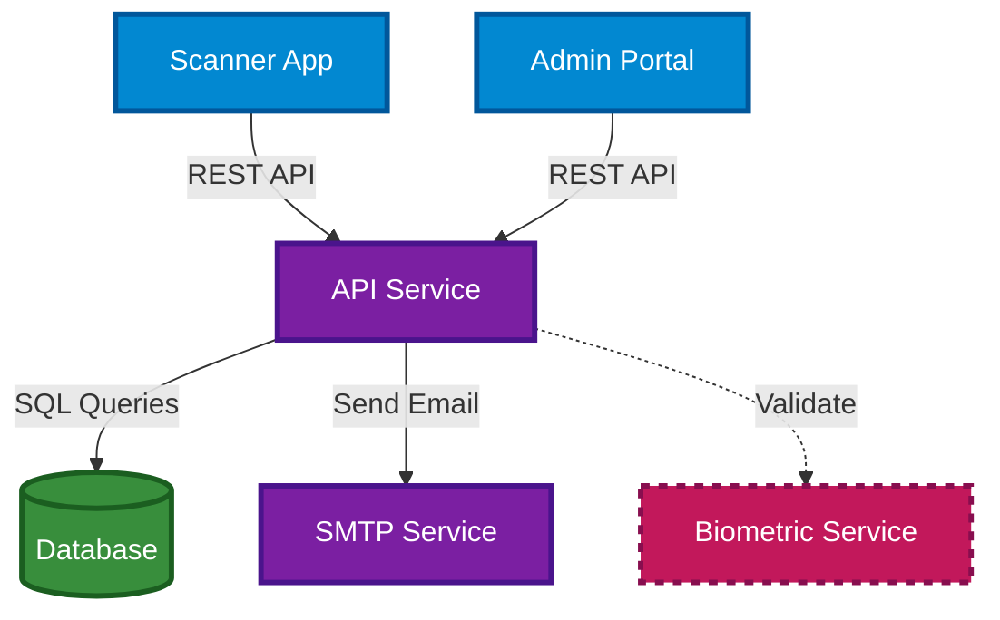

# Component Architecture

This document describes the internal components of the TAPWORK system, their responsibilities, and how they work together.

---

## Core Components

### API Service (FastAPI)

The API Service is the central hub of the TAPWORK system, responsible for all business logic and orchestration.

**Responsibilities:**
- Request handling and routing
- Authentication and authorization
- Data validation and sanitization
- Business logic execution
- Integration coordination

**Key Features:**
- **Request Handling**: Processes all HTTP requests from clients
- **Authentication**: JWT-based token validation for secure access
- **Authorization**: Role-based access control (RBAC) implementation
- **Data Validation**: Input sanitization and validation using Pydantic models
- **Business Logic**: Attendance rules, overtime calculations, late/early detection
- **Integration Hub**: Coordinates between database, SMTP, and optional services

**Technology Stack:**
- FastAPI (Python 3.11+)
- Pydantic for data validation
- SQLAlchemy for ORM
- JWT for authentication
- Uvicorn as ASGI server

---

### PostgreSQL Database

Relational database providing persistent storage for all system data.

**Responsibilities:**
- Data persistence and retrieval
- Data integrity enforcement
- Transaction management
- Query optimization

**Key Features:**
- **Data Models**: Employees, Attendance Records, Shifts, Departments, Roles
- **Relationships**: Foreign keys maintain data integrity
- **Indexing**: Optimized indexes for fast querying
- **Transactions**: ACID compliance ensures data consistency
- **Backups**: Automated daily backups with point-in-time recovery
- **Performance**: Connection pooling and query optimization

**Key Tables:**
- `users` - Employee information and credentials
- `attendance_records` - All check-in/check-out records
- `qr_codes` - QR code assignments and metadata
- `shifts` - Work shift definitions
- `departments` - Organizational structure
- `audit_logs` - System activity tracking

---

### Scanner Application (Web Client)

Progressive Web App (PWA) that serves as the primary employee interface for attendance recording.

**Responsibilities:**
- QR code capture and scanning
- User interface for employees
- Offline data handling
- Real-time feedback

**Key Features:**
- **Technology Stack**: Built with modern JavaScript frameworks (React/Vue.js)
- **Camera Integration**: Uses WebRTC MediaDevices API to access device camera
- **QR Code Processing**: Real-time QR code detection and validation
- **Offline Capability**: Service Workers enable basic functionality without internet
- **Responsive Design**: Works seamlessly on mobile phones, tablets, and desktop computers
- **User Experience**: Simple, intuitive interface requiring minimal training

**Functionality:**
- Real-time camera preview for QR scanning
- Instant feedback on successful/failed scans
- Error handling and user guidance
- Local caching for improved performance
- Automatic retry logic for failed submissions

---

### SMTP Service

Email notification system for automated communications with users and administrators.

**Responsibilities:**
- Email composition and delivery
- Template management
- Queue management
- Delivery tracking

**Key Features:**
- **Development Environment**: Uses Mailhog for email testing without sending real emails
- **Production Environment**: Configurable SMTP server (SendGrid, Amazon SES, etc.)
- **Notification Types**: 
  - Attendance confirmations
  - Late arrival alerts
  - Missing clock-out reminders
  - Weekly/monthly reports
  - System alerts for administrators
- **Template System**: HTML email templates with dynamic content
- **Queue Management**: Asynchronous email sending to prevent blocking

**Configuration:**
- SMTP server settings (host, port, credentials)
- Email templates (Jinja2)
- Sending rate limits
- Retry policies

---

### Admin/HR Portal

Web-based management interface for HR personnel and system administrators.

**Responsibilities:**
- System configuration management
- Employee management
- Report generation
- Monitoring and analytics

**Key Features:**
- Real-time attendance monitoring dashboard
- Custom report generation
- Employee account management
- System configuration interface
- Audit log review
- Analytics and insights

**User Roles:**
- **HR Manager**: Full access to employee data and reports
- **System Administrator**: System configuration and user management
- **Supervisor**: Limited access to team attendance data
- **Viewer**: Read-only access to reports

---

## Optional Components

### Biometric Service

Future-ready module for enhanced identity verification beyond QR codes.

**Responsibilities:**
- Biometric data capture
- Identity verification
- Secure data storage
- Privacy compliance

**Key Features:**
- **Purpose**: Adds an additional layer of security beyond QR codes
- **Technologies**: Face recognition, fingerprint scanning
- **Integration**: Loosely coupled via REST API calls
- **Activation**: Can be enabled/disabled per location or employee group
- **Privacy**: Compliant with biometric data regulations (GDPR, BIPA, CCPA)
- **Fallback**: System continues working if biometric validation is unavailable

**Implementation Status**: 
- Currently in planning phase
- Architecture supports seamless integration
- Will not disrupt existing functionality when added
- Modular design allows phased rollout

---

## Infrastructure Components

### Docker Containers

All TAPWORK services run in Docker containers for consistency and portability.

**Container Configuration:**
- `tapwork-api`: FastAPI application server
- `tapwork-db`: PostgreSQL database
- `tapwork-smtp`: Mailhog (dev) or SMTP relay (prod)
- `tapwork-scanner`: Static file server for Scanner App
- `tapwork-biometric` (optional): Biometric validation service

**Benefits:**
- Consistent environment across development, testing, and production
- Easy version management and rollback
- Resource isolation and optimization
- Simplified deployment process

---

### Kubernetes Deployments (Optional)

For production environments requiring high availability and auto-scaling.

**Kubernetes Resources:**
- **Deployments**: API, SMTP, Biometric services
- **StatefulSet**: PostgreSQL database
- **Services**: Internal and external service discovery
- **Ingress**: External traffic routing and TLS termination
- **ConfigMaps**: Configuration management
- **Secrets**: Sensitive data storage (passwords, tokens)
- **PersistentVolumes**: Database storage

**Scaling Strategy:**
- Horizontal Pod Autoscaler for API service
- Vertical scaling for database
- Resource limits and requests defined
- Health checks and readiness probes

---

## Component Status

| Component | Status | Environment |
|-----------|--------|-------------|
| API Service | ✅ Active | All |
| PostgreSQL Database | ✅ Active | All |
| Scanner Application | ✅ Active | All |
| SMTP Service | ✅ Active | All |
| Admin/HR Portal | ✅ Active | All |
| Biometric Service | 🔄 Planned | Future |
| Kubernetes Deployment | 🔄 Optional | Production |

---

## Component Interactions

---

## Security Considerations

### Authentication
- JWT tokens with configurable expiration
- Secure token storage (httpOnly cookies)
- Refresh token rotation

### Authorization
- Role-based access control (RBAC)
- Granular permissions per endpoint
- Admin action audit logging

### Data Protection
- Encryption in transit (TLS/SSL)
- Encryption at rest for sensitive data
- Secure password hashing (bcrypt)
- Input validation and sanitization

### Network Security
- API rate limiting
- CORS configuration
- Request size limits
- DDoS protection (production)

---

:::tip
Each component is designed to be independently deployable and scalable, following microservices best practices while maintaining system cohesion.
:::