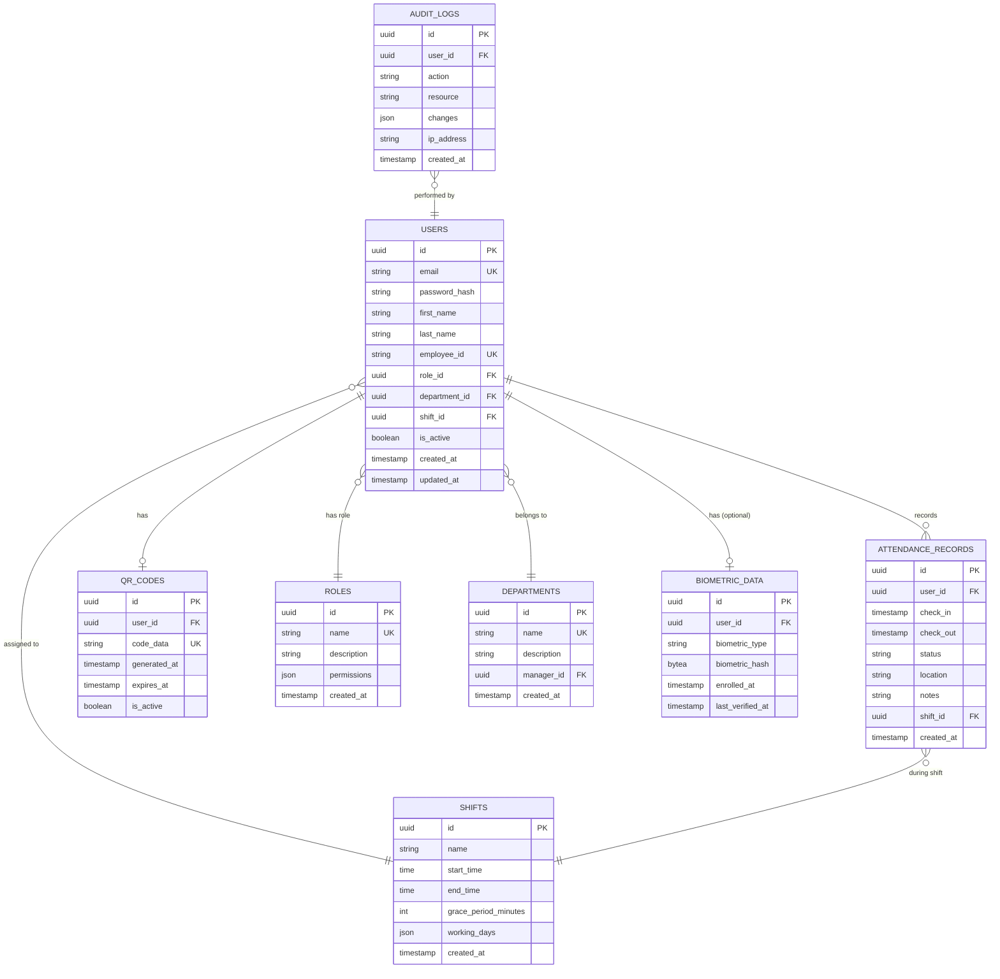

# Data Architecture

This document describes the database schema, data models, and relationships within the TAPWORK system.

---

## Database Schema Overview

TAPWORK uses PostgreSQL as its primary database, with a normalized relational schema designed for data integrity, query performance, and scalability.

### Design Principles

**Normalization**
- Third Normal Form (3NF) to minimize redundancy
- Clear separation of concerns across tables
- Foreign key constraints enforce referential integrity

**Performance**
- Strategic indexing on frequently queried columns
- Composite indexes for multi-column queries
- Partial indexes for filtered queries

**Scalability**
- Connection pooling for efficient resource usage
- Prepared statements for query optimization
- Partitioning strategies for large tables (future)

---

## Entity Relationship Diagram



---

## Table Definitions

### Users Table

Stores employee information and authentication credentials.

**Columns:**
- `id` (UUID, PK): Unique identifier
- `email` (VARCHAR, UK): Employee email address
- `password_hash` (VARCHAR): Bcrypt hashed password
- `first_name` (VARCHAR): Employee first name
- `last_name` (VARCHAR): Employee last name
- `employee_id` (VARCHAR, UK): Company employee ID
- `role_id` (UUID, FK): Reference to roles table
- `department_id` (UUID, FK): Reference to departments table
- `shift_id` (UUID, FK): Reference to shifts table
- `is_active` (BOOLEAN): Account status
- `created_at` (TIMESTAMP): Record creation time
- `updated_at` (TIMESTAMP): Last update time

**Indexes:**
- Primary key on `id`
- Unique index on `email`
- Unique index on `employee_id`
- Index on `is_active` for filtering
- Composite index on `department_id, is_active`

---

### Attendance Records Table

Stores all check-in and check-out events.

**Columns:**
- `id` (UUID, PK): Unique identifier
- `user_id` (UUID, FK): Reference to users table
- `check_in` (TIMESTAMP): Check-in time
- `check_out` (TIMESTAMP, nullable): Check-out time
- `status` (VARCHAR): Status (on-time, late, early, overtime)
- `location` (VARCHAR, nullable): Check-in location
- `notes` (TEXT, nullable): Additional notes
- `shift_id` (UUID, FK): Reference to shifts table
- `created_at` (TIMESTAMP): Record creation time

**Indexes:**
- Primary key on `id`
- Index on `user_id` for user queries
- Index on `check_in` for date range queries
- Composite index on `user_id, check_in` for user history
- Index on `status` for reporting

**Constraints:**
- Foreign key to `users(id)` with CASCADE delete
- Foreign key to `shifts(id)`
- Check constraint: `check_out >= check_in`

---

### QR Codes Table

Manages QR code assignments for employees.

**Columns:**
- `id` (UUID, PK): Unique identifier
- `user_id` (UUID, FK): Reference to users table
- `code_data` (VARCHAR, UK): Encoded QR data
- `generated_at` (TIMESTAMP): Generation time
- `expires_at` (TIMESTAMP, nullable): Expiration time
- `is_active` (BOOLEAN): Active status

**Indexes:**
- Primary key on `id`
- Unique index on `code_data`
- Index on `user_id`
- Composite index on `is_active, expires_at`

**Constraints:**
- Foreign key to `users(id)` with CASCADE delete
- Unique constraint on `user_id` (one active QR per user)

---

### Roles Table

Defines user roles and permissions.

**Columns:**
- `id` (UUID, PK): Unique identifier
- `name` (VARCHAR, UK): Role name (e.g., "Employee", "Admin")
- `description` (TEXT): Role description
- `permissions` (JSONB): JSON object containing permissions
- `created_at` (TIMESTAMP): Record creation time

**Default Roles:**
- `Employee`: Basic attendance recording
- `Supervisor`: View team attendance
- `HR Manager`: Manage employees and reports
- `Admin`: Full system access

**Permission Structure:**
```json
{
  "attendance": ["read", "create"],
  "users": ["read"],
  "reports": ["read", "generate"],
  "settings": []
}
```

---

### Departments Table

Organizational structure definition.

**Columns:**
- `id` (UUID, PK): Unique identifier
- `name` (VARCHAR, UK): Department name
- `description` (TEXT): Department description
- `manager_id` (UUID, FK, nullable): Reference to users table
- `created_at` (TIMESTAMP): Record creation time

**Indexes:**
- Primary key on `id`
- Unique index on `name`
- Index on `manager_id`

---

### Shifts Table

Work shift definitions and schedules.

**Columns:**
- `id` (UUID, PK): Unique identifier
- `name` (VARCHAR): Shift name (e.g., "Morning", "Night")
- `start_time` (TIME): Shift start time
- `end_time` (TIME): Shift end time
- `grace_period_minutes` (INTEGER): Late arrival grace period
- `working_days` (JSONB): Array of working days [1-7]
- `created_at` (TIMESTAMP): Record creation time

**Example Working Days:**
```json
[1, 2, 3, 4, 5]  // Monday through Friday
```

---

### Biometric Data Table (Optional)

Stores biometric enrollment data for enhanced security.

**Columns:**
- `id` (UUID, PK): Unique identifier
- `user_id` (UUID, FK): Reference to users table
- `biometric_type` (VARCHAR): Type (face, fingerprint)
- `biometric_hash` (BYTEA): Encrypted biometric template
- `enrolled_at` (TIMESTAMP): Enrollment time
- `last_verified_at` (TIMESTAMP, nullable): Last verification time

**Security:**
- Biometric data is hashed/encrypted, never stored raw
- Compliant with GDPR, BIPA, CCPA requirements
- Strict access controls on this table

---

### Audit Logs Table

Tracks all system actions for compliance and security.

**Columns:**
- `id` (UUID, PK): Unique identifier
- `user_id` (UUID, FK, nullable): User who performed action
- `action` (VARCHAR): Action type (CREATE, UPDATE, DELETE, LOGIN)
- `resource` (VARCHAR): Resource affected (users, attendance)
- `changes` (JSONB): JSON object with old/new values
- `ip_address` (VARCHAR): Client IP address
- `created_at` (TIMESTAMP): Action timestamp

**Indexes:**
- Primary key on `id`
- Index on `user_id`
- Index on `created_at` for time-based queries
- Index on `action` for filtering

---

## Data Relationships

### One-to-Many Relationships

**User → Attendance Records**
- One user can have many attendance records
- Cascade delete: Deleting a user removes their attendance history

**User → Audit Logs**
- One user can have many audit log entries
- No cascade delete: Logs persist for compliance

**Department → Users**
- One department contains many users
- Restrict delete: Cannot delete department with assigned users

**Shift → Users**
- One shift can be assigned to many users
- Restrict delete: Cannot delete shift with assigned users

### One-to-One Relationships

**User ↔ QR Code**
- Each user has exactly one active QR code
- Cascade delete: Deleting user removes QR code

**User ↔ Biometric Data** (Optional)
- Each user can have one biometric enrollment per type
- Cascade delete: Deleting user removes biometric data

---

## Data Access Patterns

### Common Queries

**Get User Attendance History**
```sql
SELECT * FROM attendance_records 
WHERE user_id = ? 
AND check_in >= ? 
AND check_in < ?
ORDER BY check_in DESC;
```

**Find Late Arrivals Today**
```sql
SELECT u.*, a.*, s.start_time
FROM attendance_records a
JOIN users u ON a.user_id = u.id
JOIN shifts s ON a.shift_id = s.id
WHERE DATE(a.check_in) = CURRENT_DATE
AND TIME(a.check_in) > s.start_time + INTERVAL '? minutes'
AND a.status = 'late';
```

**Department Attendance Summary**
```sql
SELECT d.name, COUNT(a.id) as check_ins, 
       COUNT(CASE WHEN a.status = 'late' THEN 1 END) as late_count
FROM departments d
JOIN users u ON d.id = u.department_id
JOIN attendance_records a ON u.id = a.user_id
WHERE DATE(a.check_in) = CURRENT_DATE
GROUP BY d.name;
```

---

## Data Migration Strategy

### Version Control
- Alembic for database migrations
- Sequential migration scripts
- Rollback support for all migrations

### Migration Process
1. Create migration script
2. Test on development database
3. Review and approve changes
4. Apply to staging environment
5. Deploy to production with backup

---

## Backup and Recovery

### Backup Strategy
- **Full Backups**: Daily at 2:00 AM UTC
- **Incremental Backups**: Every 6 hours
- **Transaction Logs**: Continuous archiving
- **Retention**: 30 days for daily, 7 days for incremental

### Recovery Procedures
- Point-in-time recovery capability
- Automated backup verification
- Documented restore procedures
- Regular disaster recovery drills

---

## Performance Optimization

### Indexing Strategy
- Primary keys on all tables (UUID)
- Unique indexes on email, employee_id, code_data
- Composite indexes for common query patterns
- Partial indexes for filtered queries

### Query Optimization
- Connection pooling (min: 5, max: 20)
- Prepared statements for frequent queries
- Query result caching (Redis future consideration)
- EXPLAIN ANALYZE for slow queries

### Future Enhancements
- Table partitioning for attendance_records by date
- Read replicas for reporting queries
- Materialized views for complex reports
- Archived data strategy for old records

---

:::tip Database Management
Regular database maintenance includes VACUUM, ANALYZE, and index rebuilding to maintain optimal performance. Monitoring tools track query performance, connection pool usage, and slow query logs.
:::