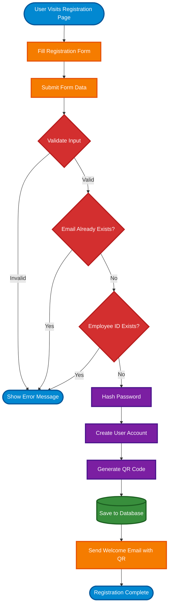
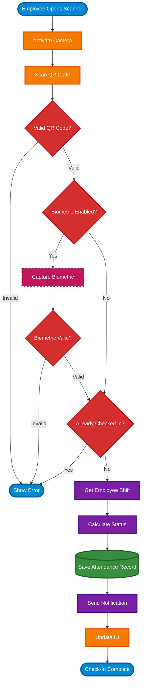
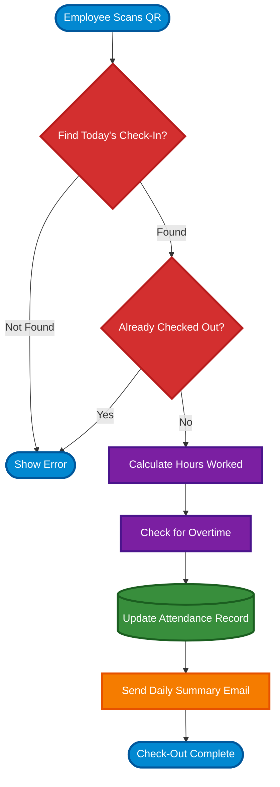

# Process Flows

This document describes the key workflows and business processes within the TAPWORK system.

---

## User Registration Flow

The registration process creates a new user account, generates a unique QR code, and sends credentials via email.



### Registration Steps

#### 1. User Input Collection
**User provides:**
- Email address
- Password (minimum 8 characters)
- First name and last name
- Employee ID (unique company identifier)
- Department selection
- Shift assignment

**Validation rules:**
- Email must be valid format and unique
- Password must meet complexity requirements
- Employee ID must be unique within system
- All required fields must be filled

#### 2. Data Validation
**API validates:**
- Email format and uniqueness
- Password strength (uppercase, lowercase, numbers, special chars)
- Employee ID uniqueness
- Department exists in system
- Shift exists and is active

**Error handling:**
- Return specific error messages
- Highlight invalid fields
- Suggest corrections

#### 3. Account Creation
**System performs:**
- Hash password using bcrypt (cost factor 12)
- Create user record in database
- Assign default role (Employee)
- Set account status to active
- Record creation timestamp

#### 4. QR Code Generation
**System generates:**
- Unique QR code containing encrypted user data
- Base64 encoded QR image (PNG format)
- QR code metadata (generation time, expiration)
- Store QR code mapping in database

**QR Code data structure:**
```json
{
  "user_id": "uuid",
  "employee_id": "EMP001",
  "generated_at": "timestamp",
  "signature": "hmac_signature"
}
```

#### 5. Email Notification
**Welcome email contains:**
- Welcome message with company branding
- Login credentials (email only, not password)
- QR code image embedded
- Instructions for first-time login
- Link to scanner application
- Support contact information

#### 6. Confirmation
**User receives:**
- Success message on screen
- Email with QR code
- Instructions for next steps
- Automatic redirect to login page (optional)

---

## Attendance Check-In Flow

The check-in process validates user identity and records attendance.



### Check-In Steps

#### 1. Scanner Activation
**Employee action:**
- Opens scanner application in browser
- Grants camera permissions (if first time)
- Views camera preview

**System preparation:**
- Initialize camera using WebRTC
- Load user session (if logged in)
- Check network connectivity
- Display instructions

#### 2. QR Code Scanning
**Scanning process:**
- Continuous camera frame analysis
- Real-time QR code detection
- Decode QR code data when detected
- Vibration/sound feedback on successful scan (optional)

**Data extraction:**
- Parse QR code payload
- Verify QR code signature
- Extract user identification
- Check QR code expiration

#### 3. QR Code Validation
**System validates:**
- QR code format is correct
- Signature is valid (HMAC verification)
- QR code has not expired
- User exists and is active
- QR code has not been revoked

**Validation errors:**
- Invalid format: "QR code is not valid"
- Expired: "QR code has expired, please regenerate"
- Revoked: "QR code has been revoked"
- User inactive: "Your account is inactive, contact HR"

#### 4. Biometric Verification (Optional)
**If enabled:**
- Capture biometric sample (face photo or fingerprint)
- Send to biometric service
- Compare against enrolled template
- Receive verification result with confidence score

**Fallback:**
- If biometric service unavailable, proceed without verification
- Log biometric service failure
- Notify administrators

#### 5. Duplicate Check
**System checks:**
- Query last attendance record for user
- Check if already checked in today
- If checked in, verify if check-out has occurred
- Determine if this is check-in or check-out

**Business rules:**
- Cannot check-in twice without check-out
- Cannot check-out without check-in
- Minimum 1-hour gap between check-out and next check-in

#### 6. Status Calculation
**System calculates:**
- Get employee's assigned shift
- Compare actual time with shift start time
- Apply grace period (if configured)
- Determine status: on-time, late, early, overtime

**Status determination:**
```
IF check_in <= shift_start + grace_period:
    status = "on_time"
ELSE IF check_in > shift_start + grace_period:
    status = "late"
    minutes_late = check_in - (shift_start + grace_period)
ELSE IF check_in < shift_start - 30 minutes:
    status = "early"
```

#### 7. Record Persistence
**Database transaction:**
- Create new attendance record
- Set check-in timestamp
- Store location (if available)
- Link to shift
- Set calculated status
- Commit transaction

**Record fields:**
- User ID
- Check-in timestamp
- Status (on-time, late, early)
- Location (GPS coordinates or office name)
- Device information
- Shift reference

#### 8. Notification
**Email notification sent:**
- To employee: Attendance confirmation
- To supervisor (if late): Late arrival alert
- Contains: timestamp, status, location

**Push notification (if enabled):**
- Mobile device notification
- Browser notification
- Contains brief summary

#### 9. Success Confirmation
**UI feedback:**
- Success message displayed
- Show check-in time
- Display status (on-time, late)
- Show next action (expected check-out time)
- Vibration/sound feedback

---

## Attendance Check-Out Flow

Similar to check-in, but records departure time and calculates hours worked.



### Check-Out Steps

#### 1. Locate Check-In Record
**System searches:**
- Find attendance record for user today
- Verify check-in exists
- Confirm check-out is null
- Retrieve check-in timestamp

#### 2. Calculate Hours Worked
**Calculation:**
```
hours_worked = check_out_time - check_in_time
regular_hours = min(hours_worked, shift_duration)
overtime_hours = max(0, hours_worked - shift_duration)
```

#### 3. Update Record
**System updates:**
- Set check-out timestamp
- Calculate and store hours worked
- Update status if overtime detected
- Add any notes or comments

#### 4. Send Summary
**Daily summary email:**
- Check-in time
- Check-out time
- Total hours worked
- Overtime (if any)
- Status summary

---

## Report Generation Flow


### Report Generation Steps

#### 1. Parameter Selection
**User specifies:**
- Report type (daily, weekly, monthly, custom)
- Date range
- Department filter
- Employee filter
- Format (PDF, Excel, CSV)

#### 2. Data Query
**System queries:**
- Attendance records in date range
- Apply filters (department, employee)
- Join with user, shift, department data
- Calculate aggregations

#### 3. Data Processing
**Calculations:**
- Total attendance days
- Late arrivals count
- Absence count
- Average hours worked
- Overtime hours
- Attendance rate percentage

#### 4. Report Formatting
**System formats:**
- Apply company branding
- Generate charts and graphs
- Create summary tables
- Add footer with generation timestamp

#### 5. Delivery
**Output options:**
- Download immediately
- Email to recipient
- Schedule recurring report
- Store in report archive

---

## Error Handling Workflows

### Invalid QR Code Handling
1. Detect invalid QR format
2. Show user-friendly error message
3. Provide guidance (regenerate QR, contact support)
4. Log error for monitoring

### Network Failure Handling
1. Detect network unavailability
2. Store data locally (IndexedDB)
3. Queue for retry
4. Sync when connection restored
5. Notify user of offline status

### Biometric Failure Handling
1. Attempt biometric verification
2. If fails, retry up to 3 times
3. If still failing, fall back to QR-only
4. Log failure for review
5. Continue with attendance recording

---

:::tip Best Practices
All workflows include comprehensive error handling, audit logging, and user feedback mechanisms to ensure reliability and traceability.
:::