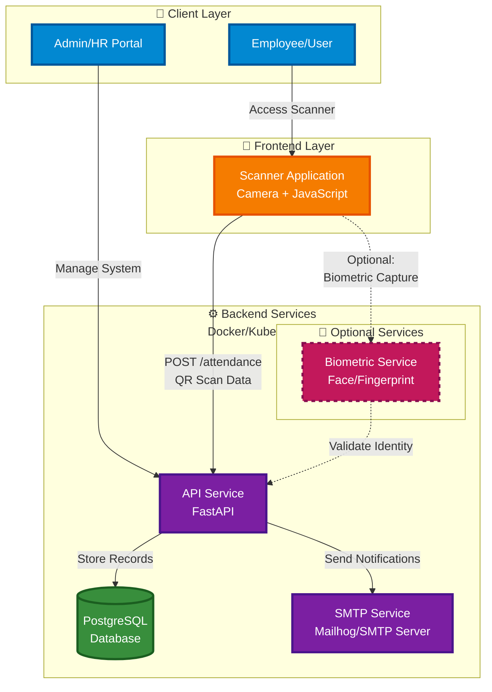

# System Overview

This document provides a high-level overview of the TAPWORK system architecture, showing how all major components interact to deliver a complete attendance management solution.

:::info Optional Biometric Service
The biometric module is included as an **optional service** to support future enhancements without affecting current functionality. The system operates fully without it.
:::

---

## High-Level Architecture

---

## Architecture Overview

The TAPWORK system follows a **three-tier architecture** designed for scalability, maintainability, and future extensibility. The architecture separates concerns into distinct layers, each with specific responsibilities and clear interfaces between them.

### System Layers

**Client Layer**
- Employee/User interface for attendance operations
- Admin/HR Portal for system management and reporting

**Frontend Layer**
- Scanner Application: Progressive Web App (PWA) for QR code scanning
- Responsive design supporting mobile, tablet, and desktop devices
- Offline-capable with Service Workers

**Backend Services Layer**
- API Service: Core business logic and request processing
- PostgreSQL: Relational database for data persistence
- SMTP Service: Email notification system
- Biometric Service (Optional): Identity verification for enhanced security

---

## Key Architectural Principles

### 1. Separation of Concerns
- Each layer has a well-defined responsibility
- Changes in one layer minimally impact others
- Clear API contracts between layers

### 2. Scalability
- Stateless API design allows horizontal scaling
- Database connection pooling optimizes resource usage
- Container orchestration (Kubernetes) enables dynamic scaling

### 3. Extensibility
- Optional services (like biometrics) can be added without system redesign
- Plugin architecture allows new features to be integrated seamlessly
- API-first design enables multiple client implementations

### 4. Security by Design
- Authentication handled at API gateway level
- Role-based access control (RBAC) for all endpoints
- Encrypted data in transit and at rest

---

## Communication Protocols

All inter-service communication uses encrypted channels and authentication tokens to ensure security:

- **Client ↔ API**: HTTPS/REST with JSON payloads
- **API ↔ Database**: PostgreSQL wire protocol (encrypted connection)
- **API ↔ SMTP**: SMTP/TLS for secure email transmission
- **API ↔ Biometric Service**: HTTPS/REST (when enabled)

---

## Technology Stack Summary

### Frontend
- React/Vue.js with Progressive Web App capabilities
- WebRTC for camera access
- Service Workers for offline support

### Backend
- FastAPI (Python 3.11+)
- PostgreSQL 15+
- Docker containers
- Kubernetes orchestration (optional)

### Infrastructure
- Container Runtime: Docker
- Orchestration: Kubernetes
- Email: Mailhog (dev) / SMTP (prod)
- Reverse Proxy: Nginx/Traefik

---

:::note Next Steps
For detailed information about specific aspects of the architecture, please refer to:
- [Component Architecture](architecture/components.md) - Detailed component descriptions
- [Data Architecture](architecture/data-architecture.md) - Database schema and relationships
- [API Architecture](architecture/api-architecture.md) - API structure and endpoints
- [Process Flows](architecture/process-flows.md) - Registration and attendance workflows
- [Deployment Architecture](architecture/deployment.md) - Docker and Kubernetes deployment
:::